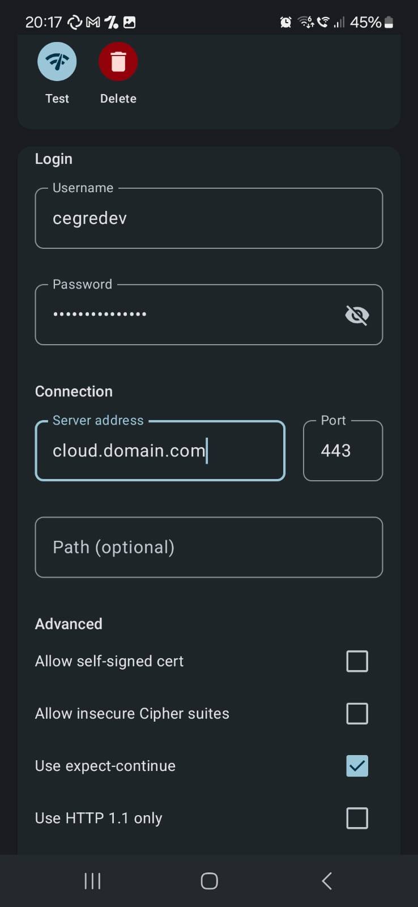

## How to setup a connection to NextCloud in FolderSync

There are 4 key pieces of information you will need:

-   **Your username**: The username you log into Nextcloud with
-   **An app password**: _Not_ your account password and explained later on
-   **The Nextcloud domain**: The domain nextcloud ist hosted on
-   **The Nextcloud path**: Only sometimes relevant

## Creating an app password

Simply using the password to your account won't always work, which is why you have to create a special **app password** for this occasion. To do this, follow these steps:

1. Go to your Nextcloud > Settings > Security
2. At the bottom of the devices section, enter a name for the app you are about to create (for example "FolderSync \{your_device_name\}"; this is just to help you recognize what apps are what for better)
3. Hit create
4. Note down the generated password (this didn't change your account password)
5. Success!

## Figuring out your Nextcloud domain

The Nextcloud domain is whatever (sub-)domain the cloud is hosted on. If your nextcloud takes you to `https://cloud.mydomain.com/apps/files/files` by default, your domain is **cloud.mydomain.com** and your path is empty.

If your Nextcloud takes you to `https://#mydomain.com/nextcloud/apps/files/files`, your domain would be **mydomain.com** and your path would be **nextcloud** or **/nextcloud**.

## Example

Now that you have all your data, you can enter it into FolderSync. Here is an example:

